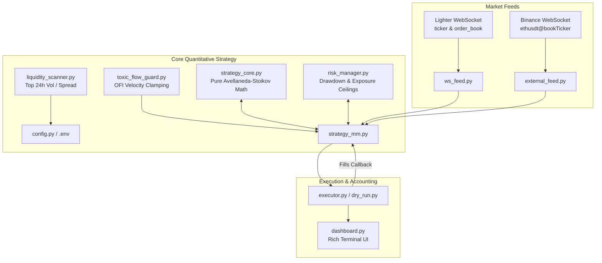

# Lighter.xyz Institutional High-Frequency Trading (HFT) & Market Making Bot

[](https://www.python.org/downloads/)
[](https://opensource.org/licenses/MIT)

An asynchronous, institutional-grade quantitative market-making and latency arbitrage framework engineered specifically for **[Lighter.xyz](https://lighter.xyz/)** perpetual futures markets. Features a unified Avellaneda-Stoikov mathematical core, multi-level quoting ladders, Order Flow Imbalance (OFI) toxic-flow defense, external Binance futures lead-lag signals, automated liquidity scanning, and strict risk kill switches.

---

## ⚠️ IMPORTANT RISK DISCLAIMER

**THIS SOFTWARE IS FOR EDUCATIONAL AND RESEARCH PURPOSES ONLY. IT IS NOT FINANCIAL ADVICE.**
Cryptocurrency perpetual futures trading and high-frequency market making carry substantial risk of capital loss. Past backtesting or dry-run performance does not guarantee future real-money returns. 
* Never commit sensitive private keys or L1 wallet credentials to version control.
* Always thoroughly test strategies in Dry Run (`BOT_MODE=dry_run`) and verify execution limits before deploying live capital.

---

## 🏗️ System Architecture & Data Flow



---

## 🧮 Mathematical Quoting Model

Our framework implements the classic **Avellaneda & Stoikov (2008)** inventory-skew framework integrated with real-time **Order Flow Imbalance (OFI)** microprices:

### 1. Volume-Weighted Microprice ($S_{micro}$)
$$S_{micro} = S_{bid} \cdot (1 - I) + S_{ask} \cdot I \quad \text{where } I = \frac{V_{bid}}{V_{bid} + V_{ask}}$$

### 2. Reservation Price ($r$)
Adjusts our indifference price relative to accumulated inventory ($q$), risk aversion ($\gamma$), and dynamic return volatility ($\sigma$):
$$r(s, q) = S_{micro} - q \cdot \gamma \cdot \sigma^2$$

### 3. Optimal Half-Spread ($\delta$)
$$\delta = \gamma \sigma^2 + \frac{2}{\gamma} \ln\left(1 + \frac{\gamma}{\kappa}\right)$$

---

## 🚀 Quick Start Guide

### 1. Install Dependencies
Using Astral's `uv` (recommended) or standard `pip`:
```powershell
pip install -r requirements.txt
```

### 2. Configure Settings (`.env`)
Copy `.env.example` to `.env` inside `lighter_hft_bot/`:
```properties
BOT_MODE=dry_run
AUTO_SCAN_MARKETS=True
MAX_SCAN_MARKETS=3
INITIAL_CAPITAL_USD=1000.0
TRADE_MARGIN_USD=20.0
LEVERAGE=5.0
```

### 3. Run Dry Run Paper Trading
```powershell
python lighter_hft_bot/main.py
```
Or using `uv`:
```powershell
uv run lighter_hft_bot/main.py
```

### 4. Run Smoke Tests
```powershell
python tests/test_smoke.py
```
